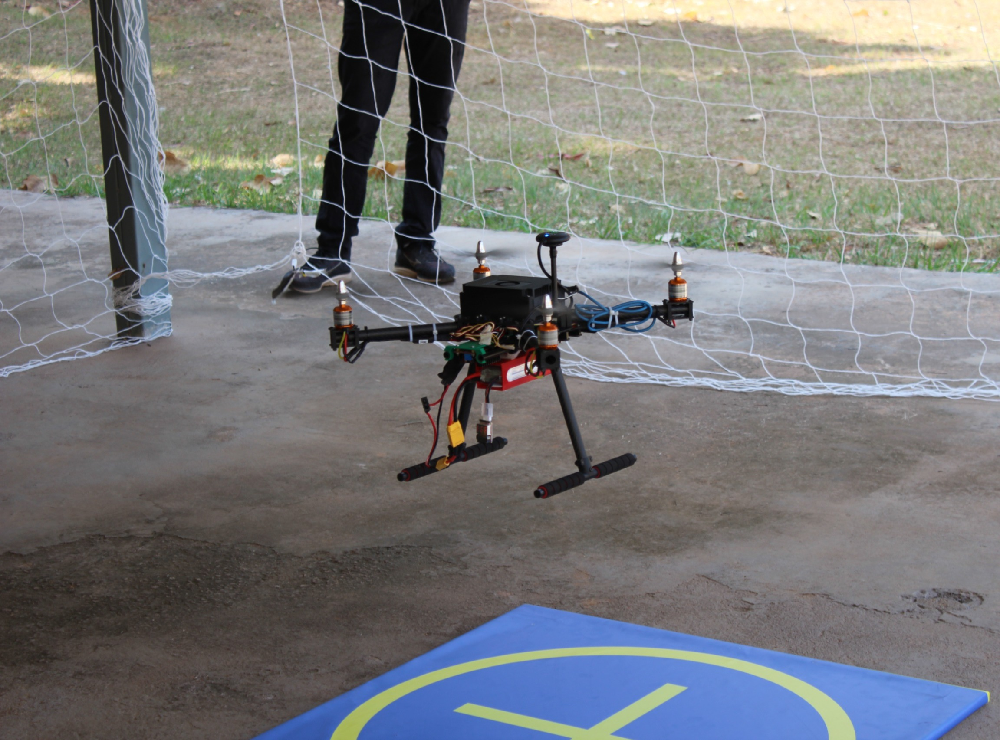

# 🛸 Flying Robots - Pequi Mecânico

Bem-vindo ao repositório oficial da equipe **Flying Robots** do **Núcleo de Robótica Pequi Mecânico**! Somos uma equipe dedicada ao desenvolvimento de drones autônomos e inteligentes para aplicações em ambientes complexos, como inspeção de dutos e operações aéreas avançadas. 🚀

---

## 🌟 Sobre Nós

A **Flying Robots** é uma das equipes do **Pequi Mecânico**, núcleo de robótica da **Universidade Federal de Goiás (UFG)**. Nosso foco está no estudo e desenvolvimento de robôs aéreos autônomos, integrando:
- **Controle avançado de voo**.
- **Navegação e mapeamento 3D**.
- **Processamento embarcado com Inteligência Artificial (IA)**.
- **Manipulação e transporte de objetos**.

Utilizamos tecnologias como **ROS2**, **Docker** e o firmware **PX4**, além de hardware avançado como o **Jetson Orin Nano** e sensores de alta precisão.

---

## 🚀 Nossos Projetos

Aqui você encontrará projetos relacionados a:
- **Controle e navegação de drones autônomos**.
- **Sistemas de mapeamento e localização em tempo real**.
- **Simulação e teste de algoritmos para ambientes reais**.

---

## 🌐 Links Oficiais

- 🌍 [Site Oficial do Pequi Mecânico](https://pequimecanico.com.br/)
- 📸 [Instagram do Pequi Mecânico](https://www.instagram.com/pequimecanico/)

---

## 📬 Contato

📧 **Email**: adm@pequimecanico.com.br  

Venha nos conhecer e contribuir para o avanço da robótica aérea! 🚁